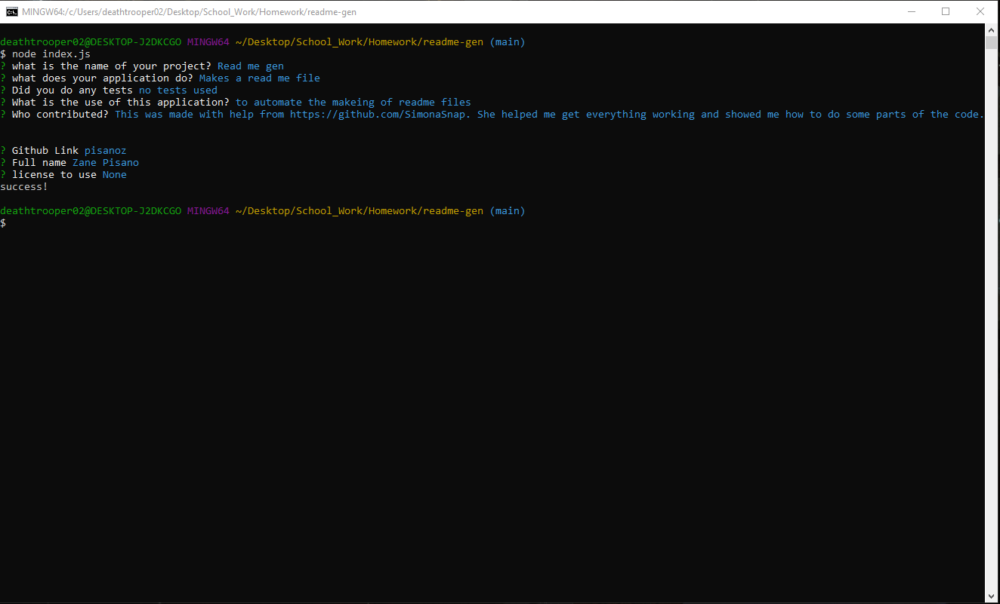

# Read me gen

## Table of Contents
* [Description](#Description)
* [Usage](#Usage)
* [Contribution](#Contribution)
* [Tests](#Tests)
* [Questions](#Questions)
* [Deployment](#Deployment)

## Description 
Makes a read me file 
## Usage 
to automate the makeing of readme files 

## Tests
no tests used
## Contribution
This was made with help from https://github.com/SimonaSnap. She helped me get everything working and showed me how to do some parts of the code.
## Questions
If you have any questions:
  - GitHub [pisanoz](https://github.com/pisanoz)
  

